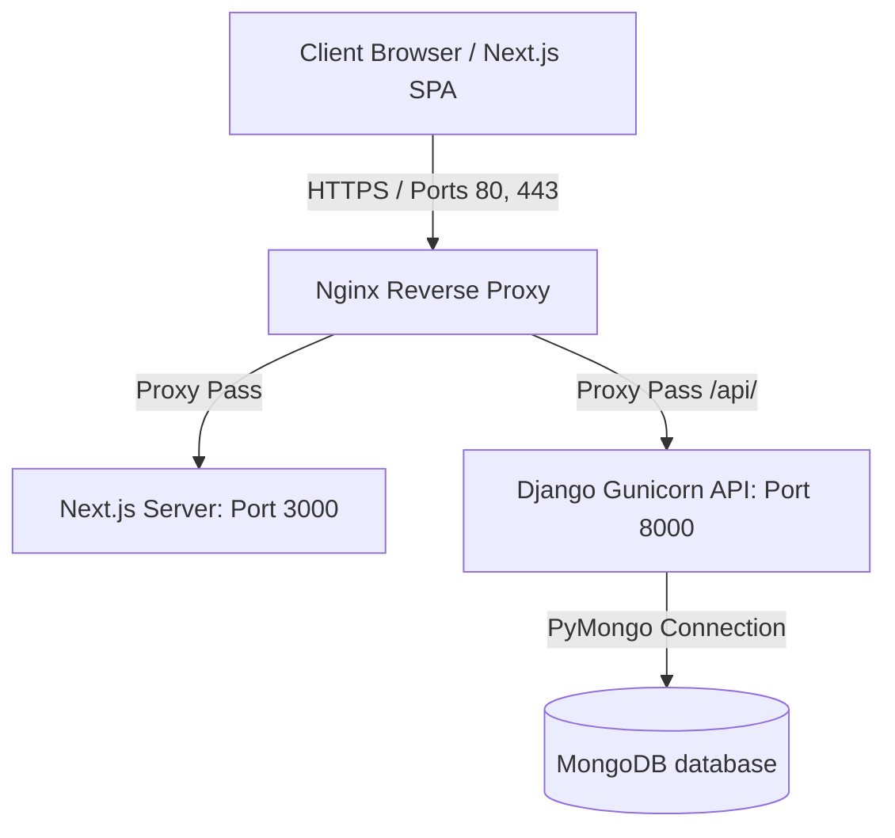

# Intermost Study Abroad - Enterprise Deployment Platform

> A premium, production-ready, full-stack platform for overseas medical education consultants. Engineered with a Next.js 14 frontend, a Django REST framework API backend, MongoDB Atlas database integration, and Nginx proxy traffic control.

---

## 🛠️ System Architecture

The Intermost platform is divided into two separate, optimized repositories orchestrated using Docker Compose:



---

## 📂 Project Repository Directory Layout

The workspace is organized to support separate code repositories while maintaining unified environment configs for Dockerized local and production runs:

```
intermost/
├── Intermost-Backend/      # Django API backend repository (Git tracked)
│   ├── .github/workflows/  # CI/CD and Bandit Security workflows
│   ├── apps/               # Django modules (Analytics, Core, Countries, etc.)
│   ├── config/             # Settings, WSGI, and main Routing
│   └── scripts/            # Seed data and MongoDB init scripts
│
├── Intermost-Frontend/     # Next.js 14 frontend web app repository (Git tracked)
│   ├── .github/workflows/  # CI/CD and Dependency Security workflows
│   ├── src/                # Next.js pages, layouts, and components
│   └── public/             # Static public assets (images, icons)
│
├── docker-compose.yml      # Local development container orchestration
├── docker-compose.prod.yml # Production-hardened container orchestration
├── nginx.conf              # Local dev Nginx proxy mapping
├── nginx.prod.conf         # Production Nginx SSL configuration
├── EC2_DEPLOYMENT.md       # AWS EC2 Instance Provisioning Guide
└── DOCKER_DEPLOYMENT.md    # Local Docker deployment guide
```

---

## 🚀 Quick Start (Local Docker Setup)

Deploy the entire workspace locally with a single command:

```bash
# 1. Clone the repository structure
git clone <parent-repo-url> intermost && cd intermost

# 2. Set up the local environment file
cp .env.example .env

# 3. Build and launch all services
docker compose up -d --build
```

Access the applications locally:
* **Frontend Application**: `http://localhost` (Port 80)
* **Backend API Console**: `http://localhost:8000` (Port 8000)
* **Interactive Swagger UI**: `http://localhost:8000/api/docs/`
* **Local Nginx Admin Route**: `http://api.localhost`

---

## 🌍 Enterprise Production Setup (AWS EC2)

For deploying the separate frontend and backend repositories on a single Linux EC2 host with Nginx and Let's Encrypt SSL, refer to the detailed:

👉 **[AWS EC2 Setup & Deployment Guide (EC2_DEPLOYMENT.md)](file:///c:/Users/Neha/Desktop/intermost/EC2_DEPLOYMENT.md)**

---

## 🤖 CI/CD & Security Audits

Both code repositories are configured with automated **GitHub Actions** checks to ensure code stability and protect against dependency vulnerabilities:

### 1. Frontend Repository Actions
* **Continuous Integration (`frontend-ci.yml`)**: Installs dependencies (`npm ci`), checks formatting (`npm run lint`), and builds the production Next.js package in Docker to guarantee compiling correctness.
* **Security Scanning (`security.yml`)**: Executes `npm audit --audit-level=high` on pushes and pull requests to flag and block high-risk package vulnerabilities.

### 2. Backend Repository Actions
* **Continuous Integration (`backend-ci.yml`)**: Installs Python packages, runs syntax linter checks (`flake8`), verifies Django settings consistency (`python manage.py check`), and runs backend Docker builds.
* **Security Scanning (`security.yml`)**: Runs `bandit` static application security testing (SAST) to inspect Python code for security issues and executes `pip-audit` to detect vulnerable requirements.

---

## 📊 Analytics & Throttling
The platform is equipped with production-grade user tracking and abuse mitigation:
- **Abuse Prevention**: Managed by Nginx connection limits and Django REST Framework throttling (`100/hour` for guests, `1000/hour` for users).
- **Dashboard Metrics**: Serves real-time visitors, session lengths, browser classification, and coordinate maps directly to the Admin UI.
